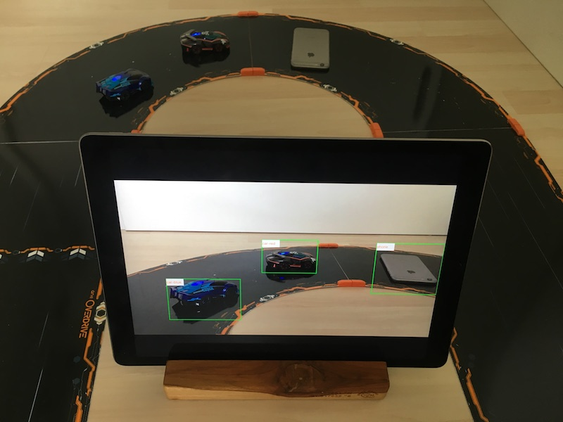
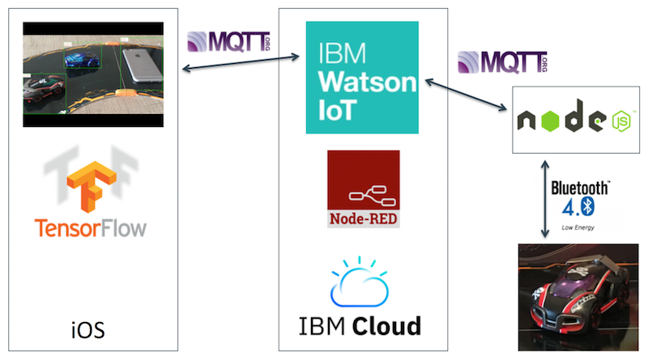

# TensorFlow Object Detection for Anki Overdrive Cars

The [object-detection-anki-overdrive-cars](https://github.com/nheidloff/object-detection-anki-overdrive-cars) project includes a trained deep learning model to recognize items on Anki Overdrive tracks and it includes documentation how to train TensorFlow Object Detection models:

* With an iOS app cars and phones can be detected on [Anki Overdrive](https://anki.com/) tracks. When an obstacle (phone) is detected, the cars stop. This project contains a trained TensorFlow Object Detection model based on MobileNet and instructions how to run it in iOS apps and Jupyter notebooks.

* The project also contains documentation how to train models to recognize other objects via [TensorFlow Object Detection](https://github.com/tensorflow/models/research/object_detection). To make the setup of the development environment as simple as possible, Docker containers are provided.

This picture shows the iPad app which recognizes the two cars and the phone:



Check out the [documentation](documentation) folder for more pictures and screenshots.


## Setup of the iOS App with the trained Model

In order to run the iOS app, a machine running MacOS is needed to compile TensorFlow 1.9.0:

```bash
$ brew install automake libtool
$ git clone https://github.com/tensorflow/tensorflow
$ cd tensorflow
$ git checkout v1.9.0
$ export ANDROID_TYPES="-D__ANDROID_TYPES_FULL__"
$ tensorflow/contrib/makefile/build_all_ios.sh
$ git clone https://github.com/nheidloff/object-detection-anki-overdrive-cars.git
```

I ran into compilation errors. Check out the [workaround](https://github.com/tensorflow/tensorflow/issues/18356) which worked for me.

Open [tensorflow.xconfig](ios/SupportingFiles/tensorflow.xconfig) in a text editor and point to the folder where you cloned the TensorFlow repo, for example:
TENSORFLOW_ROOT=/Users/nheidloff/Development/tensorflow

To install the dependencies, invoke these commands from the 'ios' directory:

```bash
$ pod clean
$ pod install
```

Open [tensorflowiOS.xcworkspace](ios/tensorflowiOS.xcworkspace) in Xcode, sign the app, connect an iOS device and launch the app.

The app recognizes now the red car, the blue car and phones.


## Training of your own Model

Follow the next steps to train models with your own objects.

### 1) Development Environment Setup

Invoke the following commands to download all necessary files and to set up a local development environment:

```bash
$ git clone https://github.com/nheidloff/object-detection-anki-overdrive-cars.git
$ cd object-detection-anki-overdrive-cars
$ my_project_dir=$(pwd)
$ export PROJECT_DIR=$my_project_dir
$ docker build -t tensorflow-od .
$ cd $PROJECT_DIR/data
$ wget http://download.tensorflow.org/models/object_detection/ssd_mobilenet_v2_coco_2018_03_29.tar.gz
$ tar xvzf ssd_mobilenet_v2_coco_2018_03_29.tar.gz
$ cp -R ${PROJECT_DIR}/data ${PROJECT_DIR}/volume/data
```

### 2) Labelling of Images and Creation of TFRecords

Take pictures from the objects you want to recognize and replace the pictures in the [volume/data/images](volume/data/images) directory.

Use [labelImg](https://github.com/tzutalin/labelImg) to create annotations. Store the annotation files in the [volume/data/annotations](volume/data/annotations) directory.

Define your objects in [volume/data/label_map.pbtxt](volume/data/label_map.pbtxt). See the [TensorFlow documentation](https://github.com/tensorflow/models/blob/master/research/object_detection/g3doc/using_your_own_dataset.md) for more details.

From what I've read these are some best practices how to create the training data:

* Take/get at least 50 pictures per object.
* Use a rather small resolution, for example 640 x 480.
* Use different sizes of your objects and different angles.
* Use pictures that have multiple objects in them.
* When marking the objects with labelImg, put the rectangles as closely as possible around the objects.
* In order to use the following script, use the JPG format.

#### Creation of TFRecords

TensorFlow Object Detection expects the input data in the TFRecord format. The following script generates two files (train.record and test.record) with a 80% / 20% split of the data.

Before running the script define your objects in [create_tfrecord.py](volume/create_tfrecord.py) (line 33ff).

Start the Docker container:

```bash
$ docker run -v $PROJECT_DIR/volume:/tensorflow/models/research/volume -it --rm tensorflow-od bash
```

In the Docker container invoke these commands:

```bash
$ cd volume
$ python create_tfrecord.py
$ exit
```


### 3) Training of the Model

For testing purposes or if you have a machine with TensorFlow GPU support, you can train the models locally.

I've used Kubernetes on the IBM Cloud to train my model since it took multiple hours. You can either use the raw Kubernetes or [Fabric for Deep Learning (FfDL)](https://github.com/IBM/FfDL) which is an open source operating system "fabric" for Deep Learning.

#### 3a) Local Training of the Model

Start the Docker container:

```bash
$ docker run -v $PROJECT_DIR/volume:/tensorflow/models/research/volume -it --rm tensorflow-od bash
```

In the Docker container invoke these commands:

```bash
$ cd volume
$ python model_main.py --model_dir=./training --pipeline_config_path=ssd_mobilenet_v2_coco.config --num_train_steps=100  --alsologtostderr
$ exit
```

#### 3b) Training of the Model on the IBM Cloud

Get a free [IBM Cloud](https://ibm.biz/nheidloff) lite account (no time restriction, no credit card required).

Install the [IBM Cloud](https://cloud.ibm.com/docs/cli/index.html#downloads) CLI.

Create a free/lite [Kubernetes cluster](https://cloud.ibm.com/catalog/?category=containers).

Install the [Kubernetes CLI](https://kubernetes.io/docs/tasks/tools/install-kubectl/).

Follow the instructions in the IBM Cloud dashboard to access your cluster from a local terminal.

Build a Docker images. Replace 'nheidloff' with your Dockerhub account name.

```bash
$ cd $PROJECT_DIR
$ docker build --file DockerfileCloud -t nheidloff/train-od .
$ docker push nheidloff/train-od
```

Open the Kubernetes Dashboard and create a new application pointing to 'nheidloff/train-od' (see [screenshot](documentation/kubernetes1.png)).

In the Kubernetes Dashboard open a terminal and invoke these commands (see [screenshot](documentation/kubernetes2.png)):

```bash
$ cd volume
$ python model_main.py --model_dir=./models/train --pipeline_config_path=ssd_mobilenet_v2_coco.config --num_train_steps=18000 --alsologtostderr
```

To copy the files to a local directory, run these commands from a local terminal. Replace 'train-56cfd5b9f-8x6q4' with your pod name.

```bash
$ cd $PROJECT_DIR/volume/training
$ kubectl get pods
$ kubectl exec train-56cfd5b9f-8x6q4 -- ls /tensorflow/models/research/volume/models/train
$ kubectl cp default/train-56cfd5b9f-8x6q4:/tensorflow/models/research/volume/models/train .
```

#### 3c) Training of the Model on the IBM Cloud with FfDL

Get a [IBM Cloud](https://ibm.biz/nheidloff) account.

Install the [IBM Cloud](https://cloud.ibm.com/docs/cli/index.html#downloads) CLI.

Create a [Kubernetes cluster](https://cloud.ibm.com/catalog/?category=containers).

Install the [Kubernetes CLI](https://kubernetes.io/docs/tasks/tools/install-kubectl/).

Follow the instructions in the IBM Cloud dashboard to access your cluster from a local terminal.

Install [FfDL](https://github.com/IBM/FfDL). You need to follow the instructions in the [Developer Guide](https://github.com/IBM/FfDL/blob/master/docs/developer-guide.md#enable-custom-learner-images-with-development-build) at this point, since custom Docker images need to be enabled in the source code first.

Create an instance of the [Cloud Object Storage](https://cloud.ibm.com/catalog/services/cloud-object-storage) service and create HMAC credentials by following these [instructions](https://datascience.ibm.com/docs/content/analyze-data/ml_dlaas_object_store.html). Make sure to use 'Writer' or 'Manager' access and note the aws_access_key_id and aws_secret_access_key for a later step.

Install and configure the AWS CLI by following these [instructions](https://cloud.ibm.com/docs/services/cloud-object-storage/cli/aws-cli.html#use-the-aws-cli).

Build a Docker images. Replace 'nheidloff' with your Dockerhub account name:

```bash
$ cd $PROJECT_DIR
$ docker build --file DockerfileCloud -t nheidloff/train-od .
$ docker push nheidloff/train-od
```

Create two buckets (use unique names):

```bash
$ aws --endpoint-url=http://s3-api.dal-us-geo.objectstorage.softlayer.net --profile ibm_cos s3 mb s3://nh-od-input
$ aws --endpoint-url=http://s3-api.dal-us-geo.objectstorage.softlayer.net --profile ibm_cos s3 mb s3://nh-od-output
```

Define your Object Storage credentials, bucket names and Docker image name in [ffdl/manifest.yml](ffdl/manifest.yml).

At the end of the FfDL installation a URL is provided to open the FfDL web UI. Open this URL in browser. It looks similar to "http://169.48.99.155:30312/#/login?endpoint=169.48.99.154:32293&username=test-user".

Upload [ffdl/manifest.yml](ffdl/manifest.yml) and [ffdl/model.zip](ffdl/model.zip) and start the training.

To copy the output files to a local directory, run these commands from a local terminal. Replace 'training-AmbQ5RAmR' with your training id.

```bash
$ cd $PROJECT_DIR/volume
$ mkdir ffdl-output
$ cd ffdl-output
$ aws --endpoint-url=http://s3-api.dal-us-geo.objectstorage.softlayer.net --profile ibm_cos s3 sync s3://nh-od-output .
$ cp -R training-AmbQ5RAmR/training $PROJECT_DIR/volume/training
```


### 4) Save the Model

The training generates checkpoint files in the 'volume/train' directory. These files need to be converted into something that is called a frozen graph file. That file is used later in the iOS app and the Python notebook.

Start the Docker container:

```bash
$ docker run -v $PROJECT_DIR/volume:/tensorflow/models/research/volume -it --rm tensorflow-od bash
```

In the Docker container invoke the following commands. Replace '100' with the number of your training runs (your last checkpoint):

```bash
$ cd volume
$ python export_inference_graph.py \
    --input_type=image_tensor \
    --pipeline_config_path=ssd_mobilenet_v2_coco.config \
    --trained_checkpoint_prefix=./training/model.ckpt-100 \
    --output_directory=frozen-graph/
$ exit
```


### 5) Testing of the Model

Before using the model in the iOS app, you can test it in a Python notebook. You can also view the training results via Tensorboard.

#### Notebook

Add two test images to [volume/testing/images](volume/testing/images) and name them 'image1.jpg' and 'image2.jpg'.

Invoke the following commands:

```bash
$ cp $PROJECT_DIR/volume/frozen-graph/frozen_inference_graph.pb $PROJECT_DIR/volume/testing/
$ cp $PROJECT_DIR/volume/data/label_map.pbtxt $PROJECT_DIR/volume/testing/
$ docker build --file DockerfileNotebook -t tensorflow-od-test .
$ docker run -v $PROJECT_DIR/volume:/tensorflow/models/research/volume -it -p 8888:8888 --rm tensorflow-od-test
```

Copy the URL with the token from the terminal and open it in a web browser. Replace the host with 'localhost'. Navigate to the folder 'object_detection' and open the notebook object_detection_anki.ipynb. In the notebook run all cells.

#### Tensorboard

In order to use Tensorboard, you can invoke the following commands:

```bash
$ cd $PROJECT_DIR/volume/training
$ docker run -d -p 6006:6006 -v $(pwd):/logs --name my-tf-tensorboard volnet/tensorflow-tensorboard
```

Open http://localhost:6006 in a browser.


### 6) Setup of the iOS App

See the steps above how to set up the iOS app with Xcode.

In order to use your own model, copy the following two files:

```bash
$ cp $PROJECT_DIR/volume/frozen-graph/frozen_inference_graph.pb $PROJECT_DIR/ios/models/
$ cp $PROJECT_DIR/volume/data/label_map.pbtxt $PROJECT_DIR/ios/models/label_map.txt
```

Sign the app, connect an iOS device and launch the app.


## Setup of the Demo to stop Cars when Obstacles are detected

In order to stop the Anki Overdrive cars when phones are put on the track, you need to set up additional components, especially the Node.js controller and the Watson IoT Platform. In order to do this, follow the instructions from my project [node-mqtt-for-anki-overdrive](https://github.com/IBM-Bluemix/node-mqtt-for-anki-overdrive).

Here is a diagram how the demo works:



You need to register a new device type 'camera' and a new device 'ios' in your IoT organization. After this you'll receive an authentication token.

Open the the file [TensorflowGraph.mm](ios/Tensorflow/TensorflowGraph.mm) in Xcode. Uncomment the lines 63 - 67 and 301 - 304 (search for 'MQTT').

Change the lines 63ff with your own IoT configuration.

Redeploy the app to your iOS device.

Rather than using the Node-RED flow of the original [project](https://github.com/IBM-Bluemix/node-mqtt-for-anki-overdrive) you need to deploy the version from this project [node-red-flow](node-red-flow) to your Node-RED instance.
